# Robot control through Microsoft Bot Framework and Cognitive Services

## Introduction

In this Lab, you will learn how to use the [Microsoft Bot Framework](https://dev.botframework.com/) and [Microsoft Cognitive Services](https://azure.microsoft.com/en-us/services/cognitive-services/) to develop an intelligent chat bot that controls manipulator robot robot powered by [ROS (Robot Operating System)](https://www.ros.org/) and [Gazebo]("http://gazebosim.org/"), the robot simulator. This lab will give you the confidence to start your journey with intelligent collaborative robotics.

The lab will focus on the development of a chat bot using the Bot Framework to control a robot that performs complex tasks (such as sorting cubes). The Bot Framework allows us to develop chat bots in different programming languages and, by adding cognitive services to it, we can make our bot intelligent and include capabilities like natural language understanding, image recognition, text recognition, language translation and more. In this lab we will create a simple bot to allow users to communicate with a physical robot using natural language and computer vision.

It is not required any previous knowledge on robotics or ROS neither having any robot hardware to complete it. 

We will use in the simulation the [Sawyer](https://www.rethinkrobotics.com/sawyer) robot, an integrated collaborative robot (aka cobot) solution designed with embedded vision, smart swappable grippers, and high-resolution force control. The robot's purpose is to automate specific repetitive industrial tasks. It comes with an arm that has a gripper which can be easily replaced by one of the available options from the ClickSmart Gripper Kit.

For the simulation, we will use Gazebo, a 3D robot simulator often used in ROS (see image below).

<p>
 <table style="border: none" align="center" >
  <tr><td><b>Gazebo simulation</b>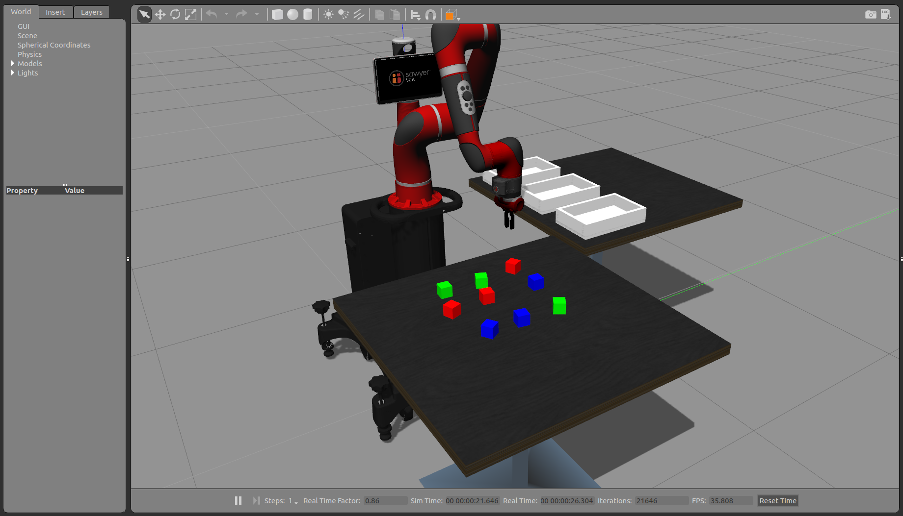</td>
   <td><b>Microsoft Bot Framework</b>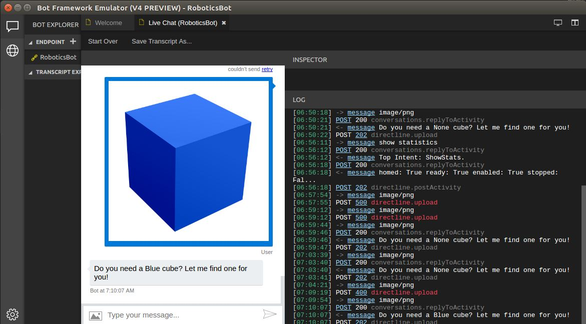</td>
   <td>
    <b>Sorting cubes video</b>
    <a href="https://www.youtube.com/watch?v=d0KZXO4mDGo" target="_blank">
       
</a>
</td>
   </tr>
  </table>
</p>

---

### Table of Contents

 - Introduction
 - Requirements and Setup
    - Host Machine Requirements
    - Setup Lab Repository & ROS
    - Setup Language Understanding
    - Setup Computer Vision
 - Hands on Lab 
    - Run Robot Simulation
    - Test the 'move your arm' command
    - Make the grippers move
    - Show robot statistics
    - Test the 'move cube' command
 - Contributing

---

## Requirements and Setup

### Host Machine Requirements
This lab requires a computer with GPU and [Ubuntu Linux 16.04](http://releases.ubuntu.com/16.04/). The main technologies that will be used locally are ROS and the bot framework. The rest of cognitive functionality will be located in the cloud. 

The setup stage has three main steps that will be described in more detail in the following sections:
 - Setup Lab Repository & ROS
 - Language Understanding Setup
 - Custom Vision Setup
 
### Setup Lab Repository and ROS

Before downloading the repository we need to install python and git.
Open a command terminal and type the following command: 

```
sudo apt-get install -y git python
```

Navigate to your home folder and clone the Lab repository with its submodule dependencies by running the following commands on the terminal: 
```
cd $HOME
git clone https://github.com/Microsoft/AI-Robot-Challenge-Lab.git --recurse-submodules
```
Now, it is time to install the rest of dependencies and build the solution. We have prepared a bundled setup script to install them (ROS, BotFramework) and build the code. Open a terminal and type following commands:

```
cd ~/AI-Robot-Challenge-Lab/setup
./robot-challenge-setup.sh
```
During the installation you might be required to introduce your sudo credentials. Please be patient; the installation will take around 30 minutes. Once completed, close the terminal as you need to refresh environment variables from the installation. 


### Setup Language Understanding

The [Language Understanding (LUIS)](https://luis.ai/) technology enables your bot to understand a user's intent from their own words. For example, we could ask the robot to move just typing: ```move arm```. 

LUIS uses machine learning to allow developers to build applications that can receive user input in natural language and extract meaning from it. 

For this lab, we have already created a bot configuration and you just need to configure it in Azure. If you want to know more about its internals, have a look at this [link](resources/robotics-bot-luis-app.json) to check out the contents.

#### Create Azure resources
First we will create the required Azure resources for LUIS. While LUIS has a standalone portal for creating and configure the model, it uses Azure for subscription management. Here, we provide you an Azure Template to create the required Azure resources without entering into the Azure Portal.
<p>
<a href="https://portal.azure.com/#create/Microsoft.Template/uri/https%3A%2F%2Fraw.githubusercontent.com%2Fpabloinigoblasco%2FAI-Robot-Challenge-Lab%2Fmaster%2Fresources%2Fluis_azure_template.json" target="_blank">
</a>

</a>
</p> 

Alternatively, you can create these resources manually for this lab following the steps described in this [link](docs/azure_resources.md). 


#### Configure LUIS Service
In the next steps we will show you how you can configure the LUIS service it will be used for this lab:

1. Login into the [LUIS portal](https://www.luis.ai). Use the same credentials as you used for logging into Azure. If this is your first login in this portal, you will receive a welcome message. Now:
    * **Scroll down** to the bottom of the welcome page.
    * Click **Create LUIS app**.
    * Select **United States** from the country list.
    * Check the **I agree** checkbox.
    * Click the **Continue** button.

<p align="center">
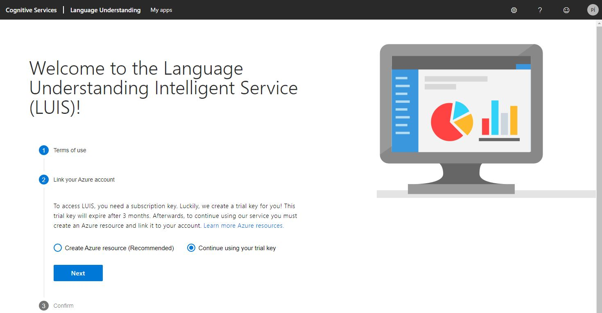
</p>

2. After that, we will get into the  `My Apps` dashboard. Now, we will import a LUIS App we have provided for this lab. 
    * Select your subscription from the subscription combo box. 
    * Select also the authoring resource you created in previous steps. If you used the Azure template, select `robotics-luis-Authoring`. 
    * Click `Import new app` to open the import dialog.

<p align="center">
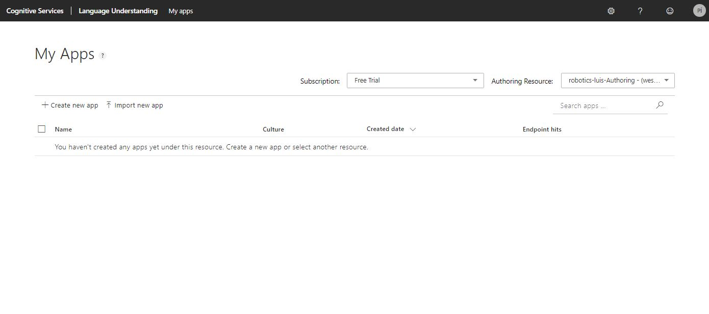
</p>

3. Now we are in the Import dialog. 
   * **Select** the base model from `~/AI-Robot-Challenge-Lab/resources/robotics-bot-luis-app.json`. 
   * click on the **Done** button to complete the import process.

<p align="center">
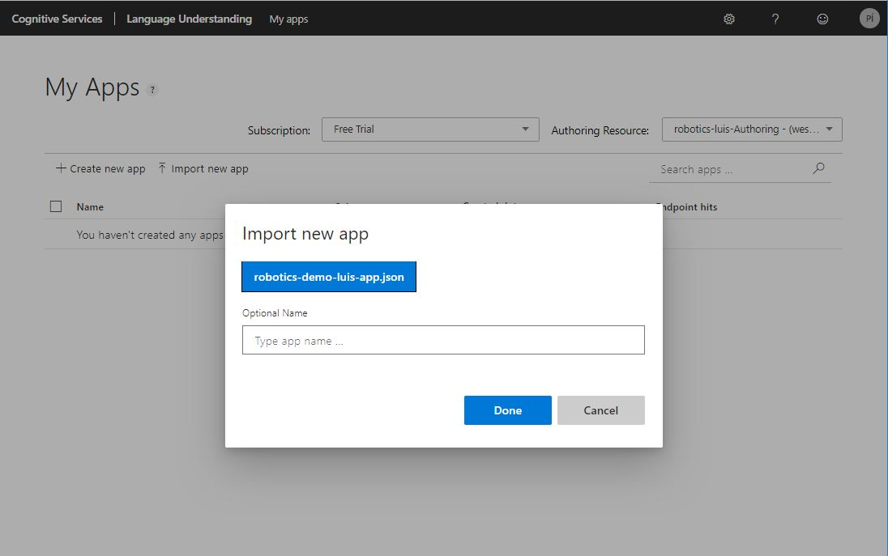
</p>


4. **Wait** for the import to complete. When it is imported successfully. You should see an image like shown below.

<p align="center">
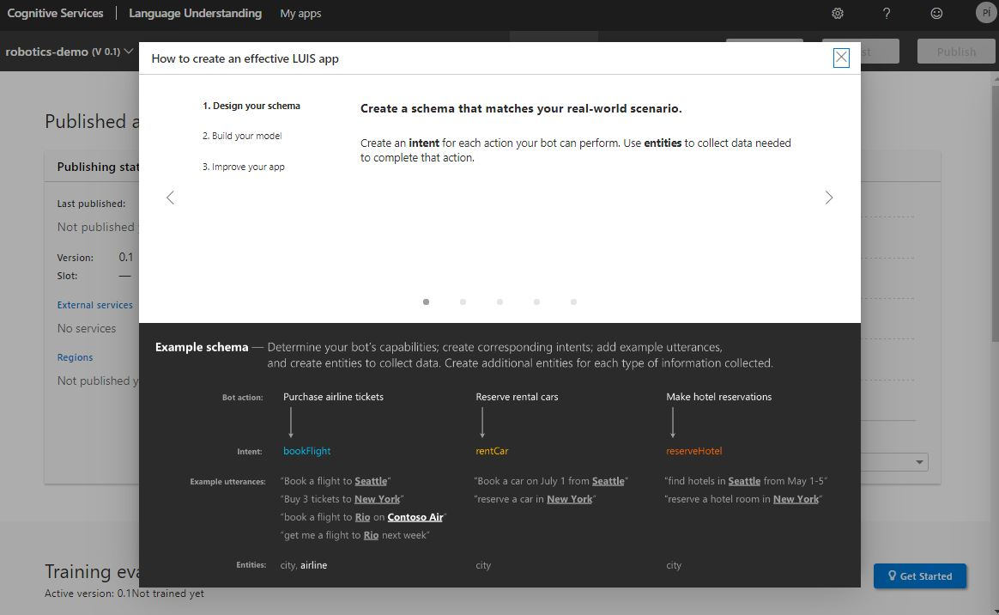
</p>

5. Click on the **Train** button and wait for it to finish. After the training, you will see a Training evaluation report where you should get 100% of success in prediction.

<p align="center">
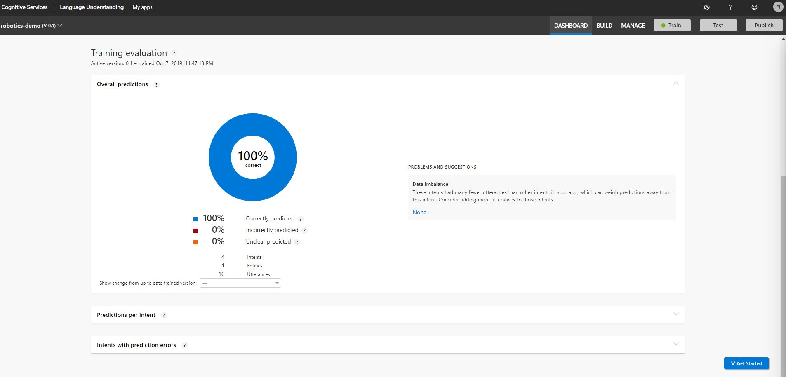
</p>

6. Now let's do a quick functionality check for the LUIS Service directly from the dashboard page.    
    * Click the **Test** button to open the test panel. 
    * Then **Type** `move arm` and press enter.

    It should return the `MoveArm` intent as it is shown in image below.

<p align="center">
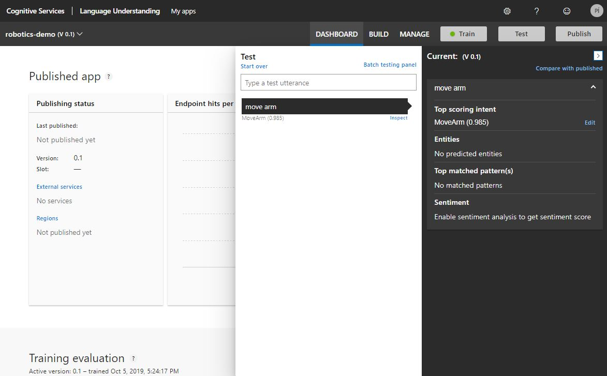
</p>


7. Now, we will handle the application keys.
    * Click on the **Manage** option.
    * Copy the LUIS `Application ID` (See image below) to Notepad . We'll need this App ID later on.

<p align="center">
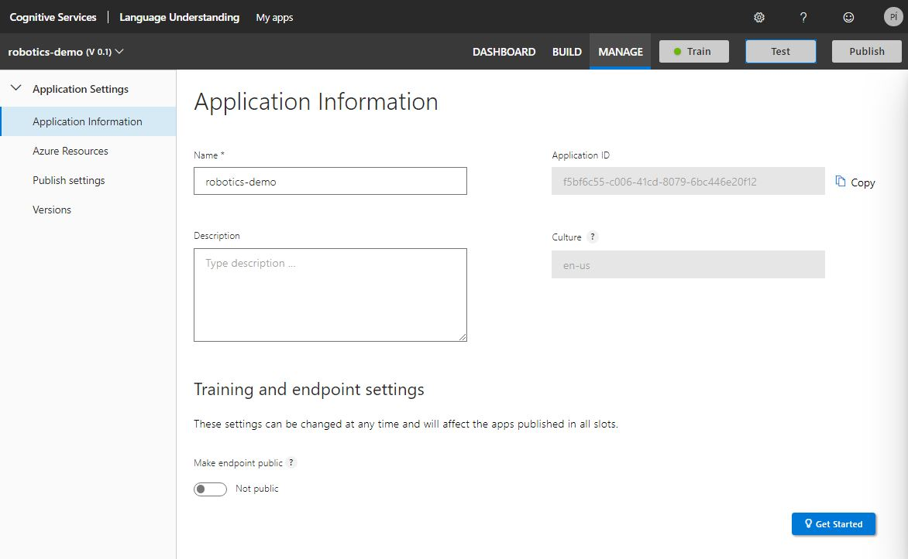
</p>
    

8. Finally, let's create a prediction resource and publish it.
    * Click the **Azure Resources** option.
    * Click on **Add prediction resource**. You might need to scroll down to find the option.
    * Select the only **tenant**.
    * Select your  **subscription**.
    * Select the **key** of your Luis resource.
    * Click on **Assign resource**.

<p align="center">
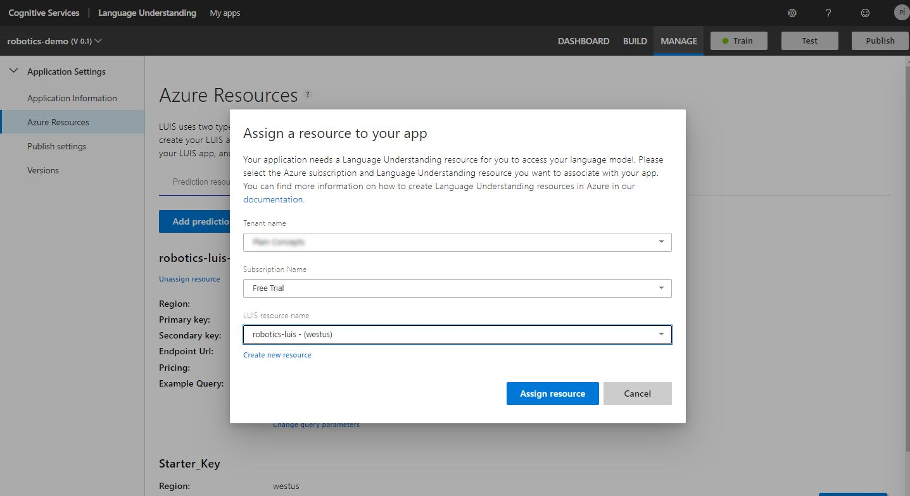
</p>


10. Publish your application:
    * Click the **Publish** button at the top right corner.
    * Click on the **Publish** button next to the *Production* slot.
    * Wait for the process to finish.

<p align="center">
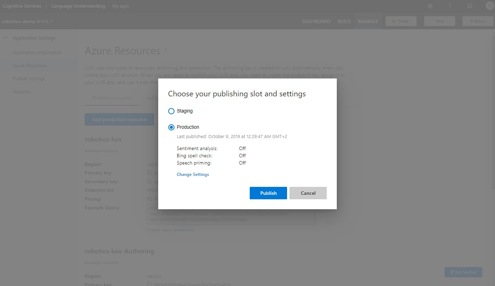
</p>

Congratulations! You have your LUIS service ready to be used. We will do that in the `Hands On Lab` section.


### Setup Computer Vision

The cloud-based Computer Vision service provides developers with access to advanced machine learning models for analyzing images. Computer Vision algorithms can analyze the content of an image in different ways, depending on the visual features you're interested in. For instance, in this lab we will be analyzing images to identify a dominant color for our robot to process. Precisely for this lab, we will use Computer Vision cognitive service to detect cube colors. 

The Computer Vision API requires a subscription key from the Azure portal. This key needs to be either passed through a query string parameter or specified in the request header.Here, we give you an Azure Template to create the required resources.

<p>
<a href="https://portal.azure.com/#create/Microsoft.Template/uri/https%3A%2F%2Fraw.githubusercontent.com%2Fpabloinigoblasco%2FAI-Robot-Challenge-Lab%2Fmaster%2Fresources%2Fazure_cv_template.json" target="_blank">
</a>

</a>
</p>

Alternatively, you can create these resources manually for this lab following the steps described in this [link](docs/azure_resources.md). 

## Hands on Lab

### Run Robot Simulation

Now the repository is downloaded and built we can launch the simulator. First enter into the intera SDK command line. To do that, type the following commands:

```
cd ~/AI-Robot-Challenge-Lab
./intera.sh sim
```

Launch the robot simulation. Type in the intera command line the following:

```
source devel/setup.bash
roslaunch sorting_demo sorting_demo.launch
```
Wait until the Sawyer robot simulation starts. If it is the first time you open Gazebo it may need to download some models and take a while. Eventually, two windows must open: 
 * Gazebo simulator
 * Rviz visualizer

<p align="center">
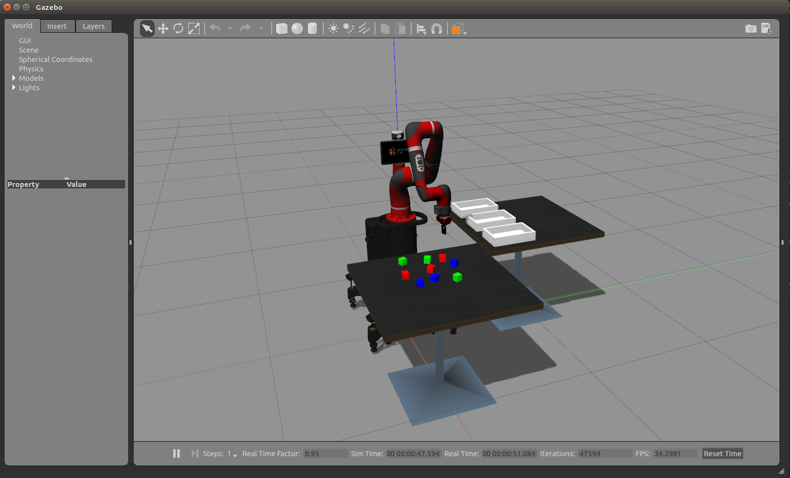
</p>

[Rviz]("http://wiki.ros.org/rviz") is an open-source 3D visualizer for the Robot Operating System (ROS) framework. It uses sensors data and custom visualization markers to develop robot capabilities in a 3D environment. For this lab, we will see the estimated robot pose based on the information received from joint sensors.

<p align="center">
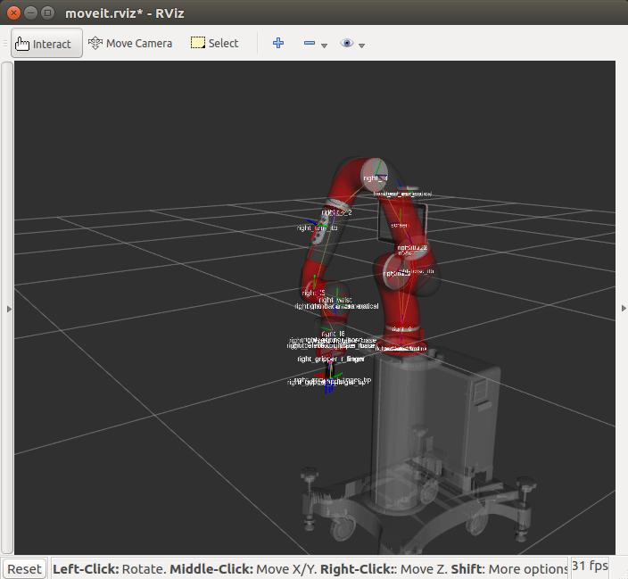
</p>

### Sorting Cubes with Sawyer

The code provided implements with ROS a complete robot application (from perception, to arm motion planning and control) with the Sawyer Robot. Feel free to have a look go the code in [src/sorting_demo](src/sorting_demo).

The main robot controllers also starts a REST server and it is listening from any action request. For example, to see how the robot sort all the cubes on the trays, open a web browser and put the following URL:

```
http://localhost:5000/start
```
The robot must start sorting cubes into the three trays. You can see that in the following video:
<a href="https://www.youtube.com/watch?v=d0KZXO4mDGo" target="_blank">
       
</a>

To stop the simulation press `Ctrl+C` in the terminal and wait for the entire process to terminate.

### Add support for Language Understanding

Now LUIS service is configured in Azure and our robot is running we can start programming our bot client in Python using the Bot Builder SDK V4. 

We'll run it locally using the Bot Framework Emulator and extend its functionality by using LUIS service to enable different operations for the robot. 

The code base includes a method to make the physical robot move/wave the arm. This method invokes a script that uses the **Intera SDK** to send commands to the robot.

Let's add language understanding support to the bot.

1. Open **Visual Studio Code**.
2. Click on **Open Folder** and select the `~/AI-Robot-Challenge-Lab/src/chatbot` folder that you extracted earlier.
3. Click on `talk-to-my-robot.py` to open the bot Python script.
4. If prompted to install the Python Extension, select Install and once installed select **Reload** to activate the extension.
5. Click on **View -> Command Palette** from the top menu and type `Python:Select Interpreter`. You should see Python 3.6 in the options and make sure to select this version.
6. Search for the `#Settings` comment. Update the LUIS **App ID** and **Key** you previously obtained:
    ```
    LUIS_APP_ID = 'UPDATE_THIS_KEY'

    LUIS_SUBSCRIPTION_KEY = 'UPDATE_THIS_KEY'
    ```

7. Go to the `BotRequestHandler` class and modify the `handle_message` method: 

    * **Hint:** Search for the **#Get LUIS result** comment and uncomment the following line:

        ```
        luis_result = LuisApiService.post_utterance(activity.text)
        ```

        > NOTE: This method is the entry point of the bot messages. Here we can see how we get the incoming request, send it to LUIS, and use the intent result to trigger specific operations. In this case it already provides support to handle the **MoveArm** intent.

1. Go to the `LuisApiService` class and modify the `post_utterance` method:

    * **Hint**: Search for the `#Post Utterance Request Headers and Params` comment and then uncomment the following lines: 
    
        ```python
        headers = {'Ocp-Apim-Subscription-Key': LUIS_SUBSCRIPTION_KEY}
        params = {
            # Query parameter
            'q': message,
            # Optional request parameters, set to default values
            'timezoneOffset': '0',
            'verbose': 'false',
            'spellCheck': 'false',
            'staging': 'false',
        }
        ```

    * Search for the `#LUIS Response` comment and then uncomment the following lines: 

        ```python
        r = requests.get('https://westus.api.cognitive.microsoft.com/luis/v2.0/apps/%s' % LUIS_APP_ID, headers=headers, params=params)
        topScoreIntent = r.json()['topScoringIntent']
        entities = r.json()['entities']
        intent = topScoreIntent['intent'] if topScoreIntent['score'] > 0.5 else 'None' 
        entity = entities[0] if len(entities) > 0 else None

        return LuisResponse(intent, entity['entity'], entity['type']) if entity else LuisResponse(intent)
        ```
    * Delete the line containing `return None` below the above code.

    > NOTE: Check your indentation to avoid Python compilation errors.

11. Save the **talk-to-my-robot.py** file.

### Test the 'move your arm' command

The bot emulator provides a convenient way to interact and debug your bot locally. Let's use the emulator to send requests to our bot:

1. Review the Explorer from the left pane in **VS Code**. Find the **CHATBOT** folder and expand it. 
2. Right-click the `talk-to-my-robot.py` file.
3. Select **Run Python File in Terminal** to execute the bot script. Install the **VS Code** Python extension if that option is not available

    > NOTE: Dismiss the alert: `Linter pylint is not installed` if prompted. If you get compilation errors, ensure you have selected the correct interpreter in step 1 of the previous section and your indentation is correct.


<p align="center">
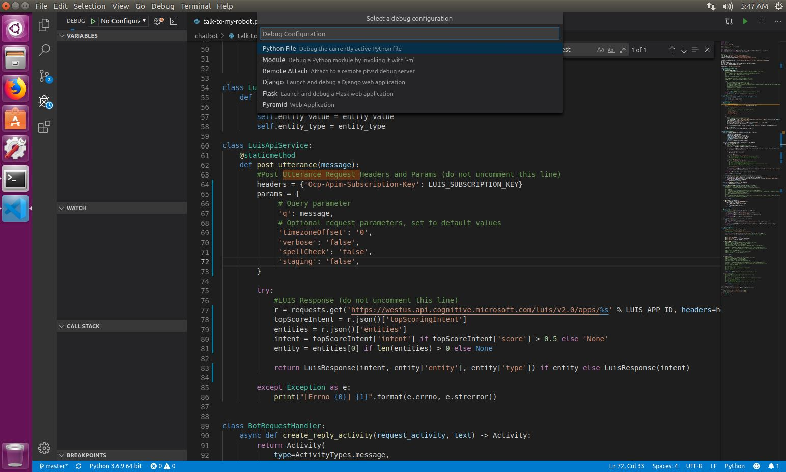
</p>

4. Open the **Bot Framework Emulator** app.

<p align="center">
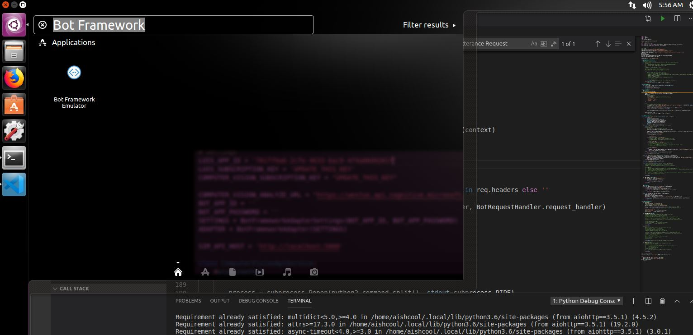
</p>

5. Click **Open Bot** and select the file `SawyerBot.bot` from your `~/AI-Robot-Challenge-Lab/src/chatbot` directory.

    > NOTE: The V4 Bot Emulator gives us the ability to create bot configuration files for simpler connectivity when debugging.

<p align="center">
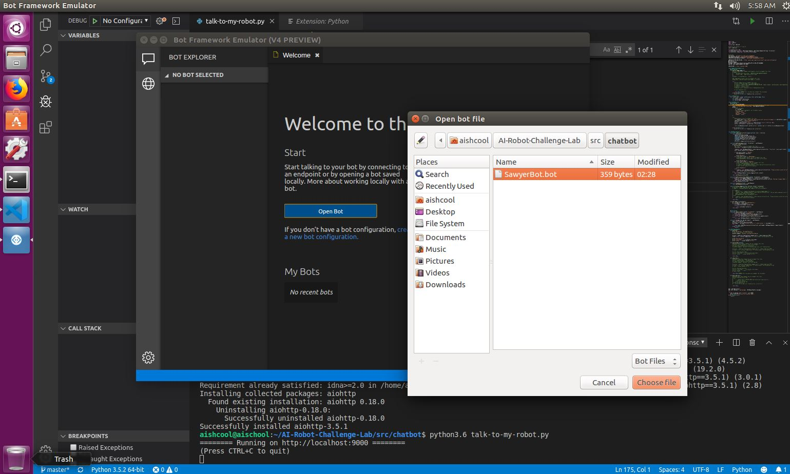
</p>

6. Relaunch the simulator if it is closed
   ```
   cd ~/AI-Robot-Challenge-Lab
   ./intera.sh sim
   ```
   Launch the robot simulation. Type in the intera command line the following:

   ```
   source devel/setup.bash
   roslaunch sorting_demo sorting_demo.launch
   ```

7. **Type** `move your arm` and press enter.

<p align="center">
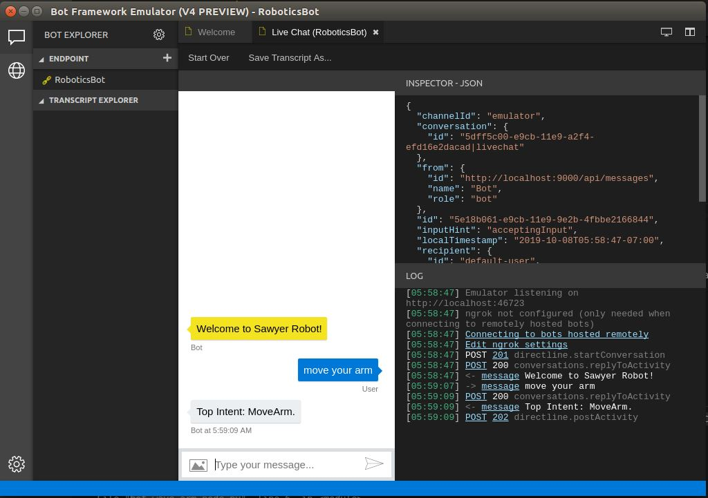
</p>

8. Return to **Gazebo** and wait for the simulator to move the arm.
9. **Stop** the bot by pressing **CTRL+C** in **VS Code** Terminal.

### Make the grippers move

1. Go to the `BotRequestHandler` class.
2. Modify the `handle_message` method:
    * **Hint**: Search for the `#Set Move Grippers Handler` comment and then uncomment the following line: 

        ```python
            BotCommandHandler.move_grippers(luis_result.entity_value)
        ```

3. Go to the `BotCommandHandler` class.
    * **Hint**: Search for the `#Implement Move Grippers Command` comment and then uncomment the following lines: 

        ```python
        print(f'{action} grippers... wait a few seconds')
        # launch your python2 script using bash
        python2_command = "bash -c 'source ~/AI-Robot-Challenge-Lab/devel/setup.bash; python2.7 bot-move-grippers.py -a {}'".format(action)  

        process = subprocess.Popen(python2_command.split(), stdout=subprocess.PIPE,shell=True)
        output, error = process.communicate()  # receive output from the python2 script

        print('done moving grippers . . .')
        print('returncode: '  + str(process.returncode))
        print('output: ' + output.decode("utf-8"))
        ```

    > NOTE: Check your indentation to avoid Python compilation errors.

4. Save the **talk-to-my-robot.py** file.

### Test 'make the grippers move' command

1. Right-click the `talk-to-my-robot.py` file from the Explorer in **VS Code**.
1. Select **Run Python File in Terminal** to execute the bot script.
1. Go back to the **Bot Framework Emulator** app.
1. Click **Start Over** to start a new conversation.
1. **Type** `close grippers` and press enter.
1. Return to **Gazebo** and wait for the simulator to move the grippers.
1. Go back to the **Bot Framework Emulator** app.
1. **Type** `open grippers` and press enter.
1. Return to **Gazebo** and wait for the simulator to move the grippers.
1. **Stop** the bot by pressing **CTRL+C** in **VS Code** Terminal.

### Show robot statistics

1. Go to the `BotRequestHandler` class.
2. Modify the `handle_message` method:

    * Search for the `#Set Show Stats Handler` comment and then uncomment the following lines: 

        ```python
        stats = BotCommandHandler.show_stats()
        response = await BotRequestHandler.create_reply_activity(activity, stats)
        await context.send_activity(response)
        ```
3. Go to the `BotCommandHandler` class.

    * Search for the `#Set Show Stats Command` comment and then uncomment the following lines:

        ```python
        print('Showing stats... do something')
        # launch your python2 script using bash
        python2_command = "bash -c 'source ~/AI-Robot-Challenge-Lab/devel/setup.bash; python2.7 bot-stats-node.py'"  

        process = subprocess.Popen(python2_command, stdout=subprocess.PIPE, shell=True)
        output, error = process.communicate()  # receive output from the python2 script
        result = output.decode("utf-8")

        print('done getting state . . .')
        print('returncode: '  + str(process.returncode))
        print('output: ' + result + '\n')
        return result
        ```
    * Delete the line containing `return None` below the above code.

    > NOTE: Check your indentation to avoid Python compilation errors.

4. Save the **talk-to-my-robot.py** file.

### Test 'show robot statistics' command

1. **Right-click** the `talk-to-my-robot.py` file from the Explorer in **VSCode**.
1. Select **Run Python File in Terminal** to execute the bot script.
1. Return to the **Bot Framework Emulator** app.
1. Click **Start Over** to start a new conversation.
1. **Type** `show stats` and press enter.
1. Wait a few seconds and wait for a response from your bot, it will display the stats in the emulator.

<p align="center">
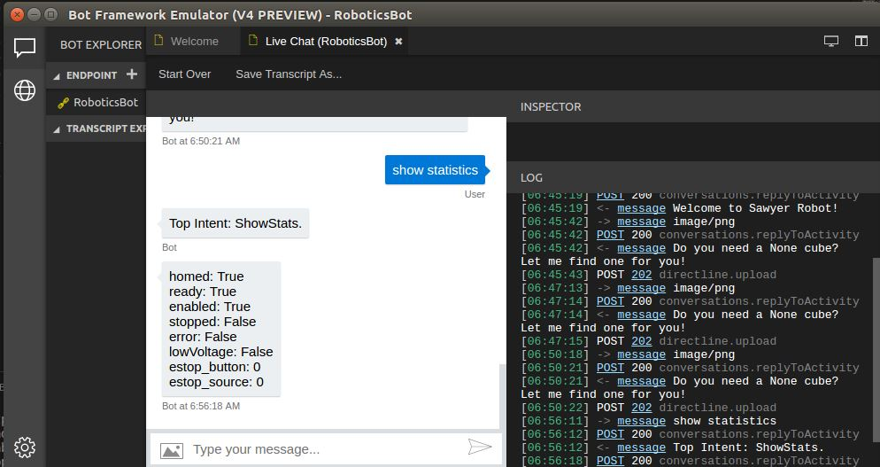
</p>

6. **Stop** the bot by pressing **CTRL+C** in **VSCode** Terminal.

## Making Your Robot Intelligent with Microsoft AI

We will use Computer Vision to extract information from an image and the Intera SDK to send commands to our robot. For this scenario we'll extract the dominant color from an image and the robot will pick up a cube of the color specified.

### Add Computer Vision to your script

1. Return to **Visual Studio Code**.
2. Open the **talk-to-my-robot.py** file.
3. Search for the `#Settings` comment update the Computer Vision **Key** you previously obtained:

    `COMPUTER_VISION_SUBSCRIPTION_KEY = 'UPDATE_THIS_KEY'`

4. Go to the `BotRequestHandler` class.

    * Search for the `#Implement Process Image Method` comment and then uncomment the following lines:
        ```python
        image_url = BotRequestHandler.get_image_url(activity.attachments)

        if image_url:
            dominant_color = ComputerVisionApiService.analyze_image(image_url)
            response = await BotRequestHandler.create_reply_activity(activity, f'Do you need a {dominant_color} cube? Let me find one for you!')
            await context.send_activity(response)
            BotCommandHandler.move_cube(dominant_color)
        else:
            response = await BotRequestHandler.create_reply_activity(activity, 'Please provide a valid instruction or image.')
            await context.send_activity(response)
        ```

5. Go to the `ComputerVisionApiService` class.
6. Modify the `analyze_image` method:

    * Search for the `#Analyze Image Request Headers and Parameters` comment and then uncomment the following lines:

        ```python
        headers = {
            'Ocp-Apim-Subscription-Key': COMPUTER_VISION_SUBSCRIPTION_KEY,
            'Content-Type': 'application/octet-stream'
        }
        params = {'visualFeatures': 'Color'}
        ```

    * Search for the `#Get Image Bytes Content` comment and then uncomment the following line:
        ```python
        image_data = BytesIO(requests.get(image_url).content)
        ```

    * Search for the `#Process Image` comment and then uncomment the following lines:

        ```python
        print(f'Processing image: {image_url}')
        response = requests.post(COMPUTER_VISION_ANALYZE_URL, headers=headers, params=params, data=image_data)
        response.raise_for_status()
        analysis = response.json()
        dominant_color = analysis["color"]["dominantColors"][0]

        return dominant_color
        ```
    * Delete the line containing `return None` below the above code.

7. Go to the `BotCommandHandler` class.
    * Search for the `#Move Cube Command` comment and then uncomment the following lines: 

        ```python
        print(f'Moving {color} cube...')
        try:
            r = requests.get(f'{SIM_API_HOST}/put_block_into_tray/{color}/1')
            r.raise_for_status()
            print('done moving cube . . .')
        except Exception as e:
            print("[Errno {0}] {1}".format(e.errno, e.strerror))
        ```
    > NOTE: Check your indentation to avoid Python compilation errors.

8. Save the **talk-to-my-robot.py** file.

### Test the 'move cube' command

1. **Right-click** the `talk-to-my-robot.py` file from the Explorer in **VS Code**.
1. Select **Run Python File in Terminal** to execute the bot script.
1. Go back to the **Bot Framework Emulator** app.
1. Click **Start Over** to start a new conversation.
1. Click the upload button from the left bottom corner to upload an image.
1. Select the file `~/AI-Robot-Challenge-Lab/resources/Images/cube-blue.png`.
<p align="center">

</p>

7. Return to **Gazebo** and wait for the simulator to move the requested cube.
1. Go back to the **Bot Framework Emulator** app.
1. Select another image of a different color and check the simulator to verify which cube it moved.

# Contributing

This project welcomes contributions and suggestions.  Most contributions require you to agree to a
Contributor License Agreement (CLA) declaring that you have the right to, and actually do, grant us
the rights to use your contribution. For details, visit https://cla.microsoft.com.

When you submit a pull request, a CLA-bot will automatically determine whether you need to provide
a CLA and decorate the PR appropriately (e.g., label, comment). Simply follow the instructions
provided by the bot. You will only need to do this once across all repos using our CLA.

This project has adopted the [Microsoft Open Source Code of Conduct](https://opensource.microsoft.com/codeofconduct/).
For more information see the [Code of Conduct FAQ](https://opensource.microsoft.com/codeofconduct/faq/) or
contact [opencode@microsoft.com](mailto:opencode@microsoft.com) with any additional questions or comments.
