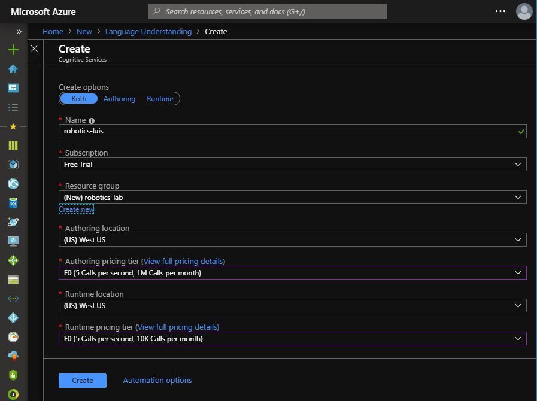
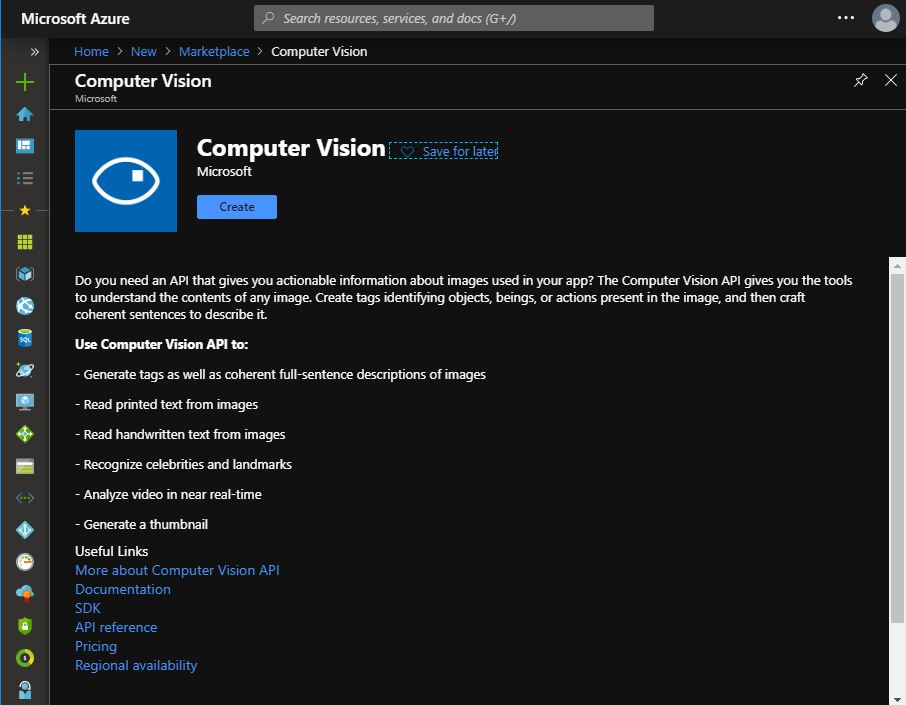

## Setup your Azure subscription

This lab **requires** an Azure subscription in order to create the Language Understanding LUIS model and the Custom Vision model.
If you need a new Azure subscription, then there are a couple of options to get a free subscription:

1. The easiest way to sign up for an Azure subscription is with VS Dev Essentials and a personal Microsoft account (like @outlook.com). This does require a credit card; however, there is a spending limit in the subscription so it won't be charged unless you explicitly remove the limit.

    * Open Microsoft Edge and go to the [Microsoft VS Dev Essentials site](https://visualstudio.microsoft.com/dev-essentials/).
    * Click **Join or access now**.
    * Sign in using your personal Microsoft account.
    * If prompted, click Confirm to agree to the terms and conditions.
    * Find the Azure tile and click the **Activate** link.

1. Alternatively, if the above isn't suitable, you can sign up for a free Azure trial.

    * Open Microsoft Edge and go to the [free Azure trial page](https://azure.microsoft.com/en-us/free/).
    * Click **Start free**.
    * Sign in using your personal Microsoft account.

1. Complete the Azure sign up steps and wait for the subscription to be provisioned. This usually only takes a couple of minutes.

## Create the LUIS resource in Azure:

1. Go to the [Azure Portal](https://portal.azure.com) and log in with your credentials.
1. Click **Create Resource [+]**  from the left menu and search for **Language Understanding**.
1. **Select** the first result and then click the **Create** button.

4. Provide the required information:
    * App name: `robotics-luis`.
    * Location: `West US`.
    * Pricing tier: `F0 (5 Calls per second, 10K Calls per month)`.
    * Create a new resource group with the name: `robotics-lab`.
    * **Confirm** that you read and understood the terms by **checking** the box.

5. Click **Create**. This step might take a few seconds.

1. Once the deployment is complete, you will see a **Deployment succeeded** notification.
1. Go to **All Resources** in the left pane and **search** for the new resource (`robotics-luis`).
1. **Click** on the resource.

Every published LUIS application needs an assigned runtime key. You can assign your runtime key to your application in the LUIS portal. We will copy ``Key1`` into **Notepad**. We'll need this key later on.

## Create the Custom Vision resource in Azure:

1. Return to the [Azure Portal](https://portal.azure.com).
1. Click **Create Resource [+]**  from the left menu and search for **Computer Vision**.
1. **Select** the first result and then click the **Create** button.

4. Provide the required information:
    * Name: `robotics-computer-vision`.
    * Select your preferred subscription.
    * Select the location: `West US`.
    * Select the the Pricing tier: `F0 (20 Calls per minute, 5k Calls per month)`.
    * Select the previously created resource group: `robotics-lab`.

5. Click **Create** to create the resource and deploy it. This step might take a few moments.
1. Once the deployment is complete, you will see a **Deployment succeeded** notification.
1. Go to **All Resources** in the left pane and **search** for the new resource (`robotics-computer-vision`).
1. **Click** on the resource.
1. Go to the **Keys** page.
1. Copy the **Key 1** value into **Notepad**.
    > NOTE: We'll need this key later on.    
    

    